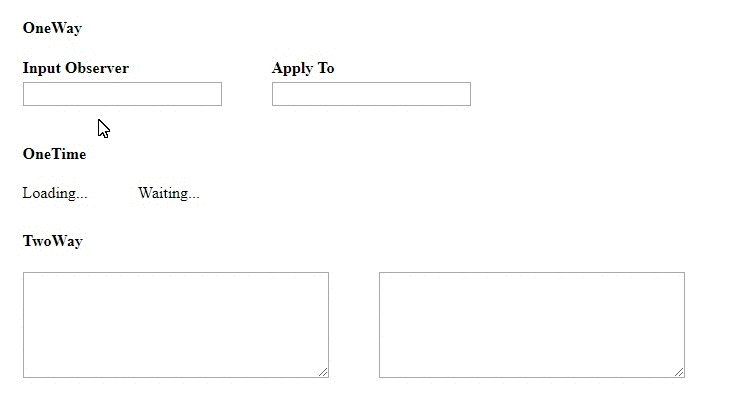

# bind-dom [&tw_p=tweetbutton&url=https%3A%2F%2Fgithub.com%2Fshystruk%2Fbind-dom&via=shystrukk) #
[](https://opensource.org/licenses/mit-license.php)

Change detection mechanisms based on [MutationObserver](https://developer.mozilla.org/en-US/docs/Web/API/MutationObserver) interface.
It provides the ability to watch for changes being made to the DOM tree. You may connect node elements in One-Time, One-Way & Two-Way binding.



## Installation
#### npm
`npm install bind-dom`

#### yarn
`yarn add bind-dom`

## Usage
```javascript
import { oneTime, oneWay, twoWay, disconnectBindDom, disconnectBindDomAll } from 'bind-dom'
```
```javascript
import bindDom from 'bind-dom'
```

## Examples ##
```javascript
import bindDom from 'bind-dom'

bindDom.oneWay('observeElement', document.querySelector('#observerNode'), document.querySelector('#toNode'))
bindDom.disconnectBindDom('observeElement')
```

```javascript
import { twoWay, disconnectBindDom } from 'bind-dom'

twoWay('twoWayObserver', document.querySelector('#observerNode'), document.querySelector('#observerNode_2'))
disconnectBindDom('twoWayObserver')
```


## API
- **oneTime(observerName, observerNode, toNode, config)** - binding occurs one time when element content change

- **oneWay(observerName, observerNode, toNode, config)** - creates an ongoing connection between *observerNode* and *toNode*
 
- **twoWay(observerName, observerNode, toNode, config)** - creates a vice versa connection between *observerNode* and *toNode*

- **disconnectBindDom(observerName)** - disconnects observer

- **disconnectBindDomAll()** - disconnects all observers

### Arguments
{String} observerName    - unique observer name<br>

{Element} observerNode   - node element which is going to be observe for DOM changes<br>

{Element} toNode         - node element to which changes is going to be applied (twoWay binding vice versa with observerNode)<br>

{Object} config          - 
```javascript
const config = {
    // what target objects to observe, { attributes: true, childList: true, subtree: true, characterData: true } by default
    members: {
        attributes: true,
        childList: true,
        subtree: true,
        characterData: true,
        attributeOldValue: true,
        characterDataOldValue: true
    },
    callback: (mutationsList) => { 
        // mutationsList[Array] - list of nodes which were changed 
    }
}
```

## Contributing
Any contributions you make **are greatly appreciated**.

Please read the [Contributions Guidelines](CONTRIBUTING.md) before adding your own helper or improvement to code snippets, explanations, etc.

## License

MIT © [Vasyl Stokolosa](https://about.me/shystruk)
